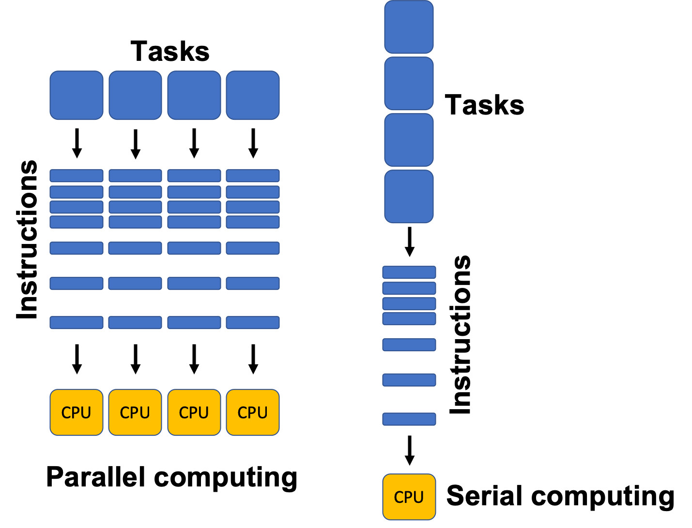

# Parallelized lidR

Simple example of how run tasks with the lidR package in parallel. This is particularly useful in situations where you need to apply functions to small disconnected las/laz files (i.e., not a full tile processed as a las catalog).

**clean_las.R** is the function you want to parallelize

**parallelize_lidR.R** is the script which runs the function in parallel

While there are several options for parallelization in R, this approach uses the [parallel](https://bookdown.org/rdpeng/rprogdatascience/parallel-computation.html) package.

